# Headless Home Assistant

A curated collection of projects and approaches that treat Home Assistant as a backend integration platform rather than a complete frontend solution.

## The Concept

"Headless" architectures are common in content publishing, where the data layer is decoupled from the presentation layer. This same principle applies remarkably well to Home Assistant.

Home Assistant excels as an **integration platform**—the central brain connecting disparate systems like MQTT, Zigbee, Z-Wave, Bluetooth Low Energy, Wi-Fi devices, and countless proprietary ecosystems. It bundles them into one centralized management system for smart homes.

However, many Home Assistant users (myself included) find that while HA is fantastic at integration, its frontend capabilities can be limiting. Lovelace cards, while hackable, are inflexible for certain use cases, and not everyone wants to trawl through HACS to find the perfect widget.

The good news: Home Assistant provides a **well-documented REST API**, **WebSocket API**, and even a **built-in MCP server**. It's ideally positioned for headless consumption.

```mermaid
flowchart TB
    subgraph "Integration Layer"
        HA[("🏠 Home Assistant<br/>(Central Brain)")]
    end

    subgraph "Protocol Bridges"
        MQTT[MQTT Broker]
        Z2M[Zigbee2MQTT]
        ZW[Z-Wave JS]
        BLE[Bluetooth LE]
        WIFI[Wi-Fi Devices]
    end

    subgraph "Headless Frontends"
        DASH[Custom Dashboards]
        MOBILE[Mobile Apps]
        KIOSK[Kiosk Displays]
        VOICE[Voice Interfaces]
        AI[AI Agents]
    end

    MQTT <--> HA
    Z2M <--> HA
    ZW <--> HA
    BLE <--> HA
    WIFI <--> HA

    HA -- "REST API" --> DASH
    HA -- "WebSocket" --> MOBILE
    HA -- "WebSocket" --> KIOSK
    HA -- "MCP" --> AI
    HA -- "API" --> VOICE
```

## The Philosophical Fork

Headless architectures are somewhat polarizing in development communities. 

However, they remain forward-thinking architecture with many significant advantages.

The most significant advantage in the context of home automation might be the ability to slice and dice the same data in very different presentation layers.: why grapple with Lovelace when you can use any frontend framework that you like and "vibe code" it in the same time it takes to create a dashboard (and with less pain). At the technical level, it also supports a separation of concerns.

While a totally dashboardless Home Assistant remains a strange proposition to many, it can actually be achieved quite easily. Home Assistant acts as the tool bundler and exposes them via MCP.

## Integration Patterns

Headless Home Assistant projects typically integrate through one of several patterns:

### Pattern Descriptions

| Pattern | Method | Best For |
|---------|--------|----------|
| **Direct API** | REST API, WebSocket | Custom dashboards, mobile apps, web frontends |
| **MQTT Bypass** | Subscribe directly to MQTT topics | Real-time displays, low-latency controls, parallel consumption |
| **MCP Integration** | Model Context Protocol | AI assistants, voice control, natural language interfaces |
| **AppDaemon** | Python automation + HADashboard | Wall-mounted tablets, kiosk displays |

## Example Projects

### Custom Dashboard Frameworks

| Project | Description | Integration Method |
|---------|-------------|-------------------|
| [HA Component Kit](https://github.com/shannonhochkins/ha-component-kit) | React-based component library for building custom HA dashboards | WebSocket API |
| [TileBoard](https://github.com/resoai/TileBoard) | Highly configurable dashboard with multiple themes (Homekit, Material, etc.) | WebSocket API |
| [Prism Dashboard](https://github.com/BangerTech/Prism-Dashboard) | Modern glassmorphism-inspired dashboard | API |
| [HADashboard](https://appdaemon.readthedocs.io/en/latest/DASHBOARD_CREATION.html) | AppDaemon's mature dashboard solution for wall-mounted tablets | AppDaemon |

### Android/Mobile Alternatives

| Project | Description | Integration Method |
|---------|-------------|-------------------|
| [WallPanel](https://community.home-assistant.io/t/wallpanel-for-android-formerly-homedash/16217) | Android browser app with motion detection, remote control features | WebSocket/Browser |
| [Fully Kiosk Browser](https://www.fully-kiosk.com/) | Android kiosk browser for dedicated HA displays | Browser |

### AI & Voice Interfaces

| Project | Description | Integration Method |
|---------|-------------|-------------------|
| [Home Assistant MCP](https://www.home-assistant.io/integrations/mcp_server/) | Built-in MCP server for LLM integration | MCP |
| [AI Agent HA](https://github.com/sbenodiz/ai_agent_ha) | AI-powered automation generator using natural language | OpenAI/Llama API |

### My Own Headless Projects

- **Custom alarm control panel** — A dedicated PyQt6 interface for alarm system control, consuming HA state via API while bypassing Lovelace entirely
- **Productivity panels** — Small-display dashboards with richer iframe and proxying support than HA provides natively
- **Voice-controlled interfaces** — Using HA's MCP server with Claude for natural language home control

## Why Go Headless?

| Benefit | Description |
|---------|-------------|
| **UI Freedom** | Build exactly the interface you need without Lovelace constraints |
| **Performance** | Optimized frontends for specific devices (e.g., e-ink displays, small screens) |
| **Multi-Platform** | Native apps for Android, iOS, desktop, embedded devices |
| **AI Integration** | LLMs can consume HA state and control devices via MCP |
| **Parallel Consumption** | Multiple frontends can consume the same HA backend |

## Architecture: Custom Alarm Panel Example

A concrete example of headless architecture—a custom alarm control panel that consumes Home Assistant as a backend:

## Contributing

## Resources

- [Home Assistant REST API](https://developers.home-assistant.io/docs/api/rest/)
- [Home Assistant WebSocket API](https://developers.home-assistant.io/docs/api/websocket/)
- [Home Assistant MCP Server](https://www.home-assistant.io/integrations/mcp_server/)
- [AppDaemon Documentation](https://appdaemon.readthedocs.io/)
- [Awesome Home Assistant](https://www.awesome-ha.com/)